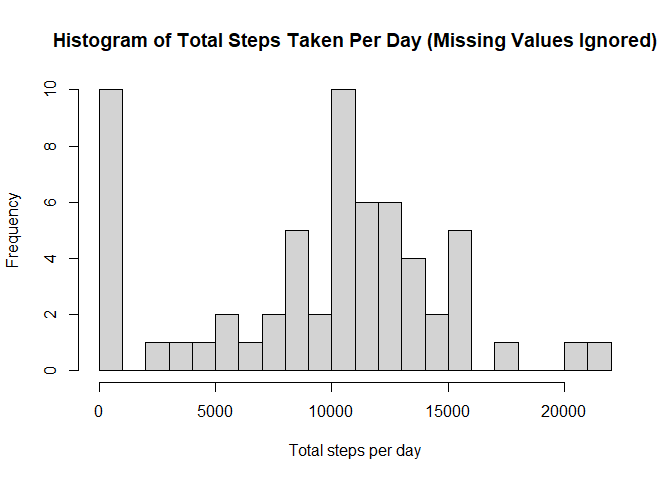
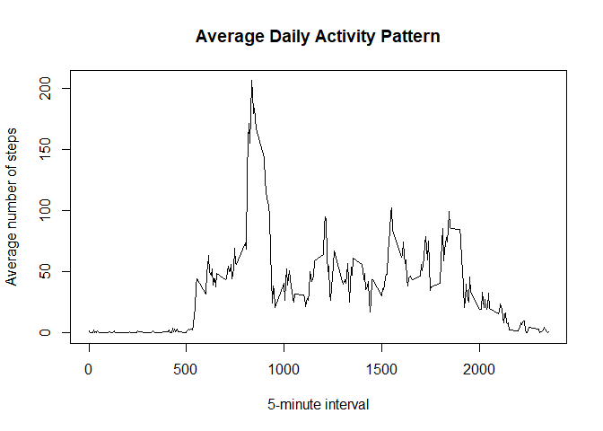
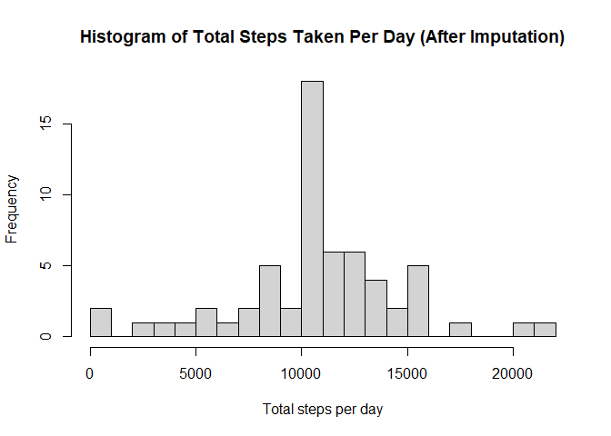
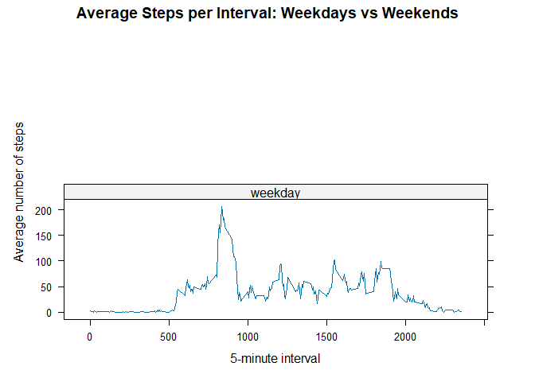

## Loading and preprocessing the data

This report analyzes personal activity monitoring data collected at 5-minute intervals across October and November 2012.  
The dataset contains the number of steps taken in each interval (`steps`), the date (`date`), and the 5-minute interval identifier (`interval`).  
All code used to produce the results is included to ensure full reproducibility.


``` r
knitr::opts_chunk$set(echo = TRUE, warning = FALSE, message = FALSE)

# Packages (install if missing)
pkgs <- c("dplyr", "ggplot2", "lattice")
for (p in pkgs) {
  if (!requireNamespace(p, quietly = TRUE)) {
    install.packages(p, repos = "https://cloud.r-project.org")
  }
}

library(dplyr)
```

```
## Warning: le package 'dplyr' a été compilé avec la version R 4.4.3
```

```
## 
## Attachement du package : 'dplyr'
```

```
## Les objets suivants sont masqués depuis 'package:stats':
## 
##     filter, lag
```

```
## Les objets suivants sont masqués depuis 'package:base':
## 
##     intersect, setdiff, setequal, union
```

``` r
library(ggplot2)
```

```
## Warning: le package 'ggplot2' a été compilé avec la version R 4.4.2
```

``` r
library(lattice)
activity <- read.csv("activity.csv", stringsAsFactors = FALSE)

#Convert date to Date class

activity$date <- as.Date(activity$date)

str(activity)
```

```
## 'data.frame':	17568 obs. of  3 variables:
##  $ steps   : int  NA NA NA NA NA NA NA NA NA NA ...
##  $ date    : Date, format: "2012-10-01" "2012-10-01" ...
##  $ interval: int  0 5 10 15 20 25 30 35 40 45 ...
```

``` r
summary(activity)
```

```
##      steps             date               interval     
##  Min.   :  0.00   Min.   :2012-10-01   Min.   :   0.0  
##  1st Qu.:  0.00   1st Qu.:2012-10-16   1st Qu.: 588.8  
##  Median :  0.00   Median :2012-10-31   Median :1177.5  
##  Mean   : 37.38   Mean   :2012-10-31   Mean   :1177.5  
##  3rd Qu.: 12.00   3rd Qu.:2012-11-15   3rd Qu.:1766.2  
##  Max.   :806.00   Max.   :2012-11-30   Max.   :2355.0  
##  NA's   :2304
```

``` r
## What is mean total number of steps taken per day?

steps_per_day <- activity %>%
group_by(date) %>%
summarise(total_steps = sum(steps, na.rm = TRUE), .groups = "drop")

head(steps_per_day)
```

```
## # A tibble: 6 × 2
##   date       total_steps
##   <date>           <int>
## 1 2012-10-01           0
## 2 2012-10-02         126
## 3 2012-10-03       11352
## 4 2012-10-04       12116
## 5 2012-10-05       13294
## 6 2012-10-06       15420
```

``` r
summary(steps_per_day$total_steps)
```

```
##    Min. 1st Qu.  Median    Mean 3rd Qu.    Max. 
##       0    6778   10395    9354   12811   21194
```

``` r
hist(steps_per_day$total_steps,
main = "Histogram of Total Steps Taken Per Day (Missing Values Ignored)",
xlab = "Total steps per day",
breaks = 20)
```

<!-- -->

``` r
mean_steps <- mean(steps_per_day$total_steps, na.rm = TRUE)
median_steps <- median(steps_per_day$total_steps, na.rm = TRUE)

mean_steps
```

```
## [1] 9354.23
```

``` r
median_steps
```

```
## [1] 10395
```

``` r
## What is the average daily activity pattern?

avg_by_interval <- activity %>%
group_by(interval) %>%
summarise(mean_steps = mean(steps, na.rm = TRUE), .groups = "drop")

head(avg_by_interval)
```

```
## # A tibble: 6 × 2
##   interval mean_steps
##      <int>      <dbl>
## 1        0     1.72  
## 2        5     0.340 
## 3       10     0.132 
## 4       15     0.151 
## 5       20     0.0755
## 6       25     2.09
```

``` r
plot(avg_by_interval$interval, avg_by_interval$mean_steps,
type = "l",
main = "Average Daily Activity Pattern",
xlab = "5-minute interval",
ylab = "Average number of steps")
```

<!-- -->

``` r
max_interval <- avg_by_interval$interval[which.max(avg_by_interval$mean_steps)]
max_interval
```

```
## [1] 835
```

``` r
## Imputing missing values

total_missing <- sum(is.na(activity$steps))
total_missing
```

```
## [1] 2304
```

``` r
# Create a named vector for interval means (for fast lookup)

interval_means <- setNames(avg_by_interval$mean_steps, avg_by_interval$interval)

# Copy data and impute

activity_imputed <- activity
na_idx <- is.na(activity_imputed$steps)

activity_imputed$steps[na_idx] <- interval_means[as.character(activity_imputed$interval[na_idx])]

# Check: no missing values remain in steps

sum(is.na(activity_imputed$steps))
```

```
## [1] 0
```

``` r
steps_per_day_imp <- activity_imputed %>%
group_by(date) %>%
summarise(total_steps = sum(steps), .groups = "drop")

hist(steps_per_day_imp$total_steps,
main = "Histogram of Total Steps Taken Per Day (After Imputation)",
xlab = "Total steps per day",
breaks = 20)
```

<!-- -->

``` r
mean_steps_imp <- mean(steps_per_day_imp$total_steps)
median_steps_imp <- median(steps_per_day_imp$total_steps)

mean_steps_imp
```

```
## [1] 10766.19
```

``` r
median_steps_imp
```

```
## [1] 10766.19
```

``` r
# Compare with earlier results

data.frame(
metric = c("Mean", "Median"),
before_imputation = c(mean_steps, median_steps),
after_imputation  = c(mean_steps_imp, median_steps_imp),
difference        = c(mean_steps_imp - mean_steps, median_steps_imp - median_steps)
)
```

```
##   metric before_imputation after_imputation difference
## 1   Mean           9354.23         10766.19  1411.9592
## 2 Median          10395.00         10766.19   371.1887
```

``` r
## Are there differences in activity patterns between weekdays and weekends?

activity_imputed <- activity_imputed %>%
mutate(
day_type = ifelse(weekdays(date) %in% c("Saturday", "Sunday"),
"weekend", "weekday"),
day_type = factor(day_type, levels = c("weekday", "weekend"))
)

table(activity_imputed$day_type)
```

```
## 
## weekday weekend 
##   17568       0
```

``` r
avg_interval_daytype <- activity_imputed %>%
group_by(day_type, interval) %>%
summarise(mean_steps = mean(steps), .groups = "drop")

head(avg_interval_daytype)
```

```
## # A tibble: 6 × 3
##   day_type interval mean_steps
##   <fct>       <int>      <dbl>
## 1 weekday         0     1.72  
## 2 weekday         5     0.340 
## 3 weekday        10     0.132 
## 4 weekday        15     0.151 
## 5 weekday        20     0.0755
## 6 weekday        25     2.09
```

``` r
xyplot(mean_steps ~ interval | day_type,
data = avg_interval_daytype,
type = "l",
layout = c(1, 2),
xlab = "5-minute interval",
ylab = "Average number of steps",
main = "Average Steps per Interval: Weekdays vs Weekends")
```

<!-- -->
